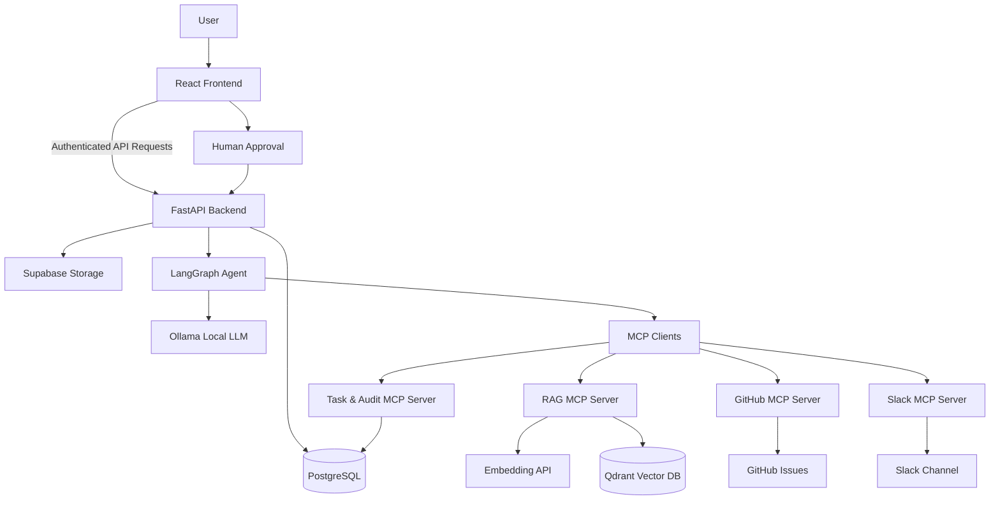

# AI Project Manager using MCP

A production-style AI project management platform that turns uploaded requirement documents into structured project analysis, generated tasks, human approval workflows, GitHub issues, Slack updates, workflow runs, and audit logs.

Demo workflow video: [Google Drive](https://drive.google.com/file/d/1cJkAlyVWC9I-bIpQs6oRGKv_HJ7jEFCs/view?usp=drive_link)

## 🚀 Overview

AI Project Manager using MCP helps move project requirements from raw documents into traceable execution workflows.

The application flow is:

1. A user signs in with Clerk.
2. The user creates a project.
3. The user uploads a requirement document.
4. The backend processes and chunks the document.
5. Embeddings are generated and stored for RAG search.
6. The user searches project documents.
7. The user runs AI project analysis.
8. A LangGraph agent retrieves context and generates structured tasks.
9. Generated tasks require human approval before downstream actions.
10. Approved tasks can become GitHub issues through a custom MCP server.
11. Slack updates can be drafted and sent through a custom MCP server.
12. Audit logs and workflow runs track the automation lifecycle.

## 🏗️ Architecture

The project follows this architecture:

```text
React Frontend
↓
FastAPI Backend
↓
LangGraph Agent
↓
MCP Clients
↓
Custom MCP Servers
↓
PostgreSQL + Qdrant + GitHub + Slack
```

Architecture diagram :



## 🧪 Demo Workflow

The demo video walks through the tested product flow:

1. Sign in
2. Create project
3. Upload document
4. Process document
5. Search project documents
6. Analyze project
7. Approve tasks
8. Create GitHub issues
9. Draft/send Slack update
10. Check audit logs
11. Check workflow runs

Video: https://drive.google.com/file/d/1cJkAlyVWC9I-bIpQs6oRGKv_HJ7jEFCs/view?usp=drive_link

## ✅ Features

- Clerk authentication for protected frontend and backend flows
- Project dashboard and project creation
- Project detail workspace
- Requirement document upload and processing
- PDF, DOCX, and TXT text extraction
- RAG-based project document search
- Qdrant vector search for document chunks
- Local embedding API using `sentence-transformers`
- LangGraph-based project analysis workflow
- Ollama/local LLM integration
- Structured task generation with JSON parsing and validation
- Human-in-the-loop task approval
- GitHub issue creation through a custom MCP server
- Slack update drafting and sending through a custom MCP server
- Task and audit workflows through a custom MCP server
- Audit log tracking
- Workflow run tracking
- Dockerized local development
- Production-oriented error handling
- Security cleanup for CORS, docs configuration, env examples, and secret leakage checks

## Tech Stack

### Frontend

- React
- TypeScript
- Vite
- Tailwind CSS
- Clerk
- React Router
- Lucide icons

### Backend

- FastAPI
- Python
- SQLAlchemy
- PostgreSQL
- Pydantic

### 🧠 AI / Agent Layer

- LangGraph
- Ollama/local LLM
- Local embedding API
- `sentence-transformers`
- `BAAI/bge-small-en-v1.5` embedding model

### MCP Layer

- MCP clients in `backend/app/services/`
- Custom MCP servers in `mcp_servers/`
- RAG MCP server
- Task/audit MCP server
- GitHub MCP server
- Slack/notification MCP server

### Vector / Search

- Qdrant

### Storage / Integrations

- Supabase Storage for uploaded documents
- GitHub Issues
- Slack
- Clerk

### DevOps

- Docker
- Docker Compose
- Environment-based configuration

## ⚙️ Local Setup

### 1. Clone the repository

```bash
git clone <repo-url>
cd AI-Project-Manager-using-MCP
```

### 2. Create environment files

```bash
cp .env.example .env
```

Create a frontend env file from `frontend/.env.example`:

```bash
cp frontend/.env.example frontend/.env.local
```

### 3. Configure services

Update `.env` with your local or managed service values:

- Clerk JWKS URL and authorized party
- PostgreSQL `DATABASE_URL`
- Qdrant URL, API key, collection name, and vector size
- Ollama base URL and model
- Supabase URL, service role key, and bucket
- GitHub token
- Slack bot token
- Internal MCP/backend API key

Update `frontend/.env.local` with public frontend values:

- `VITE_API_BASE_URL`
- `VITE_CLERK_PUBLISHABLE_KEY`

### 4. Start with Docker Compose

```bash
docker compose up --build
```

Open:

- Frontend: http://localhost:5173
- Backend docs in development: http://localhost:8000/docs
- Embedding API health: http://localhost:8001/health

If you run a local Qdrant container separately and expose the dashboard, it is typically available at:

- Qdrant dashboard: http://localhost:6333/dashboard

### Useful Docker commands

```bash
docker compose logs -f backend
docker compose logs -f frontend
docker compose down
docker compose up --build
```

## Environment Variables

Real secrets should not be committed. Use `.env` locally and `.env.example` as a safe template.

Frontend environment variables should only use public-safe `VITE_` values. Backend secrets must stay server-side.

Key configuration areas:

- App environment: `APP_ENV`, `ENABLE_API_DOCS`, `ALLOWED_ORIGINS`
- Clerk: `CLERK_JWKS_URL`, `CLERK_AUTHORIZED_PARTY`
- Backend/database: `DATABASE_URL`, `BACKEND_API_URL`, `INTERNAL_API_KEY`
- Ollama: `OLLAMA_BASE_URL`, `OLLAMA_MODEL`
- Embedding API: `EMBEDDING_API_URL`, `EMBEDDING_MODEL`
- Qdrant: `QDRANT_URL`, `QDRANT_API_KEY`, `QDRANT_COLLECTION`
- Supabase Storage: `SUPABASE_URL`, `SUPABASE_SERVICE_ROLE_KEY`, `SUPABASE_BUCKET`
- GitHub: `GITHUB_TOKEN`
- Slack: `SLACK_BOT_TOKEN`

## Repository Structure

```text
backend/
  app/
    agents/          LangGraph project analyzer
    routes/          FastAPI route modules
    services/        MCP clients and service providers
    models.py        SQLAlchemy models
    schemas.py       Pydantic schemas
    crud.py          Database access helpers

frontend/
  src/
    pages/           Dashboard, project detail, create project
    components/      Shared UI components
    api/             Authenticated API client

mcp_servers/
  rag_server.py
  task_server.py
  github_server.py
  notification_server.py

embedding_api/
  main.py            Local sentence-transformers embedding API

docker-compose.yml
.env.example
```

## Known Limitations

- Local Ollama must be running and configured correctly.
- GitHub and Slack actions require valid tokens and permissions.
- Current deployment flow is local Docker-focused.
- PostgreSQL and Qdrant are configured through environment variables and may be managed services or separately run local services.
- Document parsing quality depends on file type and extracted text quality.
- LLM output can still require validation even with JSON parsing safeguards.
- Multi-user collaboration and role-based access are future improvements.

## Highlights

- Built a production-style AI project manager using React, FastAPI, LangGraph, MCP, PostgreSQL, Qdrant, GitHub, and Slack.
- Implemented human-in-the-loop task approval before external GitHub and Slack actions.
- Designed custom MCP servers for RAG retrieval, task/audit workflows, GitHub issue creation, and Slack notifications.
- Added Dockerized local development and environment-based production hardening.
- Implemented audit logs and workflow run tracking for traceable AI automation.

## Future Improvements

- Cloud deployment
- RBAC and team collaboration
- Jira and Notion integrations
- Background job queue for long-running document and AI workflows
- Better document parsing and extraction
- Evaluation dashboard for AI outputs
